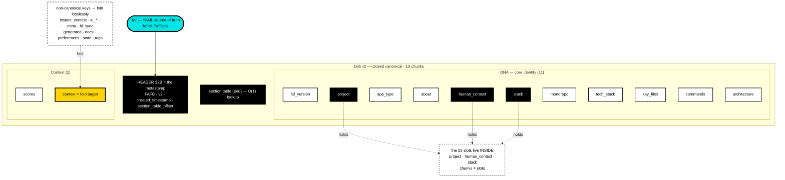

# FAFb Binary Format — v2 Specification

**Format version:** 2.0 (`version_major = 2`)
**Crate:** `faf-fafb`
**Status:** Implementation complete; reference implementation IS this crate.
**Media type:** `application/vnd.fafb` — **deliberately unregistered** (see [Registration](#registration)).

> **Version axes — say it once, then stop.** Three different numbers travel together and must not be conflated:
> - **FAF spec** `v3.3.0` — the `.faf` format ("the 33"), IFF-influenced chunk model.
> - **FAFb wire** `version_major = 2` — this binary container format.
> - **Crate semver** `faf-fafb 1.0.0` — the Rust package version.
>
> In one sentence: **faf-fafb wire v2 implements FAF-33 (spec 3.3.0).** That sentence is the whole mapping; everything below is wire v2.

---

## What FAFb is

FAFb is the compiled binary form of a `.faf` file. The `.faf` (YAML) is the
source of truth; `.fafb` is the object file. The format is **IFF-inspired**
(the Amiga Interchange File Format, the chunked design RIFF later riffed on):
a magic, a set of named chunks, a table that indexes them.

What it provides:

- **Content-addressable output** — identical content compiles to identical
  bytes (see [Closed canonical](#closed-canonical)). The same project context
  yields the same hash on every machine, so a `.fafb` can be deduped, cached,
  and verified by hash. Context gets an *identity*.
- **O(1) section lookup** — the section table sits at the end of the file; a
  reader maps any chunk by name without scanning content.
- **Priority truncation** — each chunk carries a truncation priority, so a
  reader can fit a `.fafb` into any token budget deterministically, identity
  chunks surviving last.
- **Source integrity** — a CRC32 of the originating `.faf` source is sealed
  into the header.

---

## Closed canonical

**The single design rule of v2: the writer is closed, the reader is graceful.**

- **Writer (closed).** A compiler emits *exactly* the chunks in the
  [canonical chunk table](#canonical-chunk-table), in canonical order, and
  nothing else. Non-canonical top-level YAML keys are **folded into the
  `context` chunk** — preserved in full, but never granted a section name of
  their own. There is no chunk 24: the format has a fixed shape, the way a
  JPEG has a fixed shape.
- **Reader (graceful).** A reader keeps the IFF rule — an unknown section name
  is skipped, not rejected. This lets a future **minor** version add a chunk
  to the canonical table without breaking already-deployed readers.

Why closed matters: an *open* writer (any YAML key → its own section) makes
output depend on input key order and on which optional keys happen to be
present, so the same context produces different bytes — and the format can
never be *finished*. Closing the writer is what makes the brick
content-addressable and the spec complete.

Folding rules:
- Folded keys are sorted alphabetically and inserted into `context` after any
  author-written `context` entries.
- A folded key that collides with an existing `context` sub-key is a **compile
  error** (no silent overwrite).
- A `context` value that is not a mapping, when there are keys to fold, is a
  **compile error**.

---

## File structure

```
┌─────────────────────────────────────┐
│           HEADER (32 bytes)         │
├─────────────────────────────────────┤
│         SECTION DATA (variable)     │  ← chunk payloads, canonical order
│  ┌─────────────────────────────┐    │
│  │ faf_version payload         │    │
│  │ project payload             │    │
│  │ … (canonical order) …       │    │
│  │ __string_table__ payload    │    │  ← last data section
│  └─────────────────────────────┘    │
├─────────────────────────────────────┤
│     SECTION TABLE (16 B / entry)    │  ← index, at the END (random access)
└─────────────────────────────────────┘
```

### Header (32 bytes, little-endian)

| Offset | Size | Field | Notes |
|--------|------|-------|-------|
| 0 | 4 | `magic` | `b"FAFB"` (`0x4246_4146` LE) |
| 4 | 1 | `version_major` | **2** |
| 5 | 1 | `version_minor` | 0 |
| 6 | 2 | `flags` | feature flags (below) |
| 8 | 4 | `source_checksum` | CRC32 of the source `.faf` bytes |
| 12 | 8 | `created_timestamp` | Unix seconds (0 when built deterministically) |
| 20 | 2 | `section_count` | number of section-table entries |
| 22 | 4 | `section_table_offset` | byte offset to the section table |
| 26 | 2 | `string_table_index` | section index of `__string_table__` |
| 28 | 4 | `total_size` | total file size in bytes |

> **v1→v2 wire change:** byte 26 was `reserved (u16, must be 0)` in v1; v2
> repurposes it as `string_table_index`. The 32-byte layout is otherwise
> unchanged. This is why v1 binaries are rejected rather than reinterpreted —
> see [Versioning](#versioning).

### Feature flags (2 bytes, bitfield)

| Bit | Mask | Name |
|-----|------|------|
| 0 | `0x0001` | COMPRESSED |
| 1 | `0x0002` | EMBEDDINGS |
| 2 | `0x0004` | TOKENIZED |
| 3 | `0x0008` | WEIGHTED |
| 4 | `0x0010` | MODEL_HINTS |
| 5 | `0x0020` | SIGNED |
| 6 | `0x0040` | RESOLVED |
| 7 | `0x0080` | STRING_TABLE (always set in v2) |

Readers MUST ignore unknown flag bits.

### Section entry (16 bytes, little-endian)

| Offset | Size | Field | Notes |
|--------|------|-------|-------|
| 0 | 1 | `name_index` | string-table index of this chunk's name |
| 1 | 1 | `priority` | truncation priority (0–255, higher survives longer) |
| 2 | 4 | `offset` | byte offset to section data |
| 6 | 4 | `length` | section data length |
| 10 | 2 | `token_count` | pre-computed estimate (`min(length / 4, 65535)`) |
| 12 | 4 | `flags` | bits 0–1 = classification; bits 2+ section-specific |

### String table

A length-prefixed list of section names (max 256 entries, each ≤ 255 bytes),
stored as the final data section and pointed to by `header.string_table_index`.
Section entries reference names by index, so a name is stored once regardless
of how the format evolves.

---

## Canonical chunk table

The complete, closed set of v2 section names, in serialization order. Folding
aside, this table **is** the format — **there is no chunk 14.**

The set mirrors **`faf-cli`'s `FafData`** (`src/core/types.ts`) — the single
source of truth for the `.faf` structure. **13 chunks: 11 DNA + 2 Context.**

| # | Chunk | Class | Priority |
|---|-------|-------|----------|
| 1 | `faf_version` | DNA | 255 (critical) |
| 2 | `project` | DNA | 255 (critical) |
| 3 | `app_type` | DNA | 200 |
| 4 | `about` | DNA | 150 |
| 5 | `stack` | DNA | 200 |
| 6 | `human_context` | DNA | 200 |
| 7 | `tech_stack` | DNA | 200 |
| 8 | `key_files` | DNA | 200 |
| 9 | `commands` | DNA | 180 |
| 10 | `monorepo` | DNA | 150 |
| 11 | `architecture` | DNA | 128 |
| 12 | `scores` | Context | 64 |
| 13 | `context` | Context | 64 (fold target) |

`__string_table__` is appended as the final data section; it is structural, not
a content chunk.

> **The metastamp is the header, not a chunk.** The `.faf` `generated:` key is
> *not* in this table — it maps to the header's `created_timestamp` field. The
> header (magic + version + `created_timestamp` + `section_table_offset`) plus
> the section table at the end *is* the rapid-index metastamp: O(1) lookup with
> no content parse.
>
> **Keys that fold (not chunks):** `instant_context`, the `ai_*` family,
> `context_quality`, `preferences`, `state`, `tags`, `meta`, `bi_sync`, `docs`,
> `generated`, and anything tools invent — all land in `context`, losslessly.
> (Several came from the older `faf-rust-sdk` model that had diverged from
> faf-cli; the truth is leaner.)

### The brick, visually



### Classification

Stored in bits 0–1 of each section entry's `flags`:

| Bits | Class | Meaning |
|------|-------|---------|
| `0b00` | **DNA** | core project identity |
| `0b01` | **Context** | derived output (`scores`) + the fold target (`context`) |
| `0b10` | **Pointer** | reserved (no canonical chunk uses it; the FafData truth has no `docs`) |
| `0b11` | Reserved | unused |

### Priority / budget loading

Higher priority survives truncation longer. A reader fitting a `.fafb` into a
token budget sorts chunks by priority descending, includes while the budget
allows, and always keeps `critical` (255) chunks — so project identity never
drops. This is content negotiation for AI context: one artifact, any window,
deterministic result.

---

## Versioning

- **v2 only.** A reader MUST reject any file whose `version_major` is not 2
  with `IncompatibleVersion`. FAFb v1 is pre-release history; there is no v1
  reader in this crate. The remedy is always **re-compile from the `.faf`
  source** — the YAML is the source of truth, the `.fafb` is compiled output,
  so nothing is ever trapped in an old binary.
- **Minor versions** may add chunks to the canonical table or flag bits.
  Because the reader skips unknown section names and ignores unknown flag bits,
  a v2.0 reader tolerates a v2.N file (forward-compatible within the major).

---

## Limits

| Limit | Value | Why |
|-------|-------|-----|
| Max sections | 256 | string-table index is `u8`; DoS bound |
| Max file size | 10 MB | DoS bound |
| Max token estimate | 65 535 | `token_count` is `u16` |

All multi-byte integers are little-endian. Bounds are validated on decompile:
magic, version, total-size match, and per-entry `offset + length` (checked add,
no overflow) within `total_size`.

---

## Registration

The `.faf` YAML format is IANA-registered (`application/vnd.faf+yaml`) — open,
free, the standard. **FAFb's `application/vnd.fafb` media type is deliberately
left unregistered.** This is intentional, not an oversight: do not file it.
The compiled form is held; the registration decision sits with the project
owner. A future session that "helpfully" registers it would be acting against
this note.

---

*The `.faf` is the standard; the brick is the unit of trust.*
