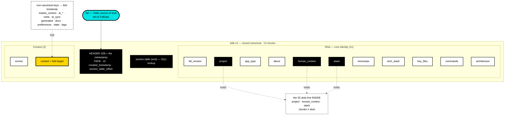

# FAFb Binary Format — v2 Specification

**Format version:** 2.0 (`version_major = 2`)
**Crate:** `faf-fafb` 1.0.5
**Status:** Implementation complete; reference implementation IS this crate.
**Media type:** `application/vnd.fafb`

> **Version axes — say it once, then stop.** Three different numbers travel together and must not be conflated:
> - **FAF spec** `v3.3.0` — the `.faf` format ("the 33"), IFF-influenced chunk model.
> - **FAFb wire** `version_major = 2` — this binary container format.
> - **Crate semver** `faf-fafb 1.0.5` — the Rust package version.
>
> In one sentence: **faf-fafb wire v2 implements FAF-33 (spec 3.3.0).** That sentence is the whole mapping; everything below is wire v2.
>
> Spec 1.9 was the hardening draft. This document **is** spec 2.0. Do not write 1.9 into the header.

---

## What FAFb is

FAFb is the compiled binary form of a `.faf` file. The `.faf` (YAML) is the
source of truth; `.fafb` is the object file. The format is **IFF-inspired**
(the Amiga Interchange File Format, the chunked design RIFF later riffed on):
a magic, a set of named chunks, and a table that indexes them.

What it provides:

- **Two identities** — a **Content ID** over what the AI reads, and a **file
  digest** over every byte (see [Identities](#identities)). A stamp never
  changes the Content ID.
- **O(1) section lookup** — the section table sits at the end of the file; a
  reader maps any chunk by name without scanning content.
- **Prefix truncation** — each chunk carries a truncation priority. Every
  truncated rendering is a prefix of the canonical rendering (see
  [Rendering](#rendering-and-truncation)).
- **Source integrity** — a CRC32 of the originating `.faf` source is sealed
  into the header.

---

## Closed canonical

**The single design rule of v2: the writer is closed, the reader is graceful.**

- **Writer (closed).** A compiler emits *exactly* the chunks in the
  [canonical chunk table](#canonical-chunk-table), in canonical order, and
  nothing else. Non-canonical top-level YAML keys are **folded into the
  `context` chunk** — preserved in full, but never granted a section name of
  their own. There is no chunk 14: the format has a fixed shape, the way a
  JPEG has a fixed shape. Writers MUST emit only structural names on the
  [structural closed list](#structural-chunks). An unknown `__` name is an
  error, not a fold.
- **Reader (graceful).** A reader keeps the IFF rule — an unknown section name
  is skipped, not rejected, **including unknown `__` names**, even if the
  matching flag bit is unset. This lets a future **minor** version add a chunk
  to the canonical table without breaking already-deployed readers.

Closing the writer is what makes the brick addressable. It does **not** mean
two independent writers of the same `.faf` produce the same Content ID — see
[Writers](#identities).

Folding rules:
- Folded keys are sorted alphabetically and inserted into `context` after any
  author-written `context` entries.
- A folded key that collides with an existing `context` sub-key is a **compile
  error** (no silent overwrite).
- A `context` value that is not a mapping, when there are keys to fold, is a
  **compile error**.

---

## File structure

```
┌─────────────────────────────────────┐
│           HEADER (32 bytes)         │
├─────────────────────────────────────┤
│         SECTION DATA (variable)     │  ← chunk payloads, canonical order
│  ┌─────────────────────────────┐    │
│  │ faf_version payload         │    │
│  │ project payload             │    │
│  │ … (canonical order) …       │    │
│  │ __string_table__ payload    │    │  ← last data section
│  └─────────────────────────────┘    │
├─────────────────────────────────────┤
│     SECTION TABLE (16 B / entry)    │  ← index, at the END (random access)
└─────────────────────────────────────┘
```

### Header (32 bytes, little-endian)

| Offset | Size | Field | Notes |
|--------|------|-------|-------|
| 0 | 4 | `magic` | `b"FAFB"` (`0x4246_4146` LE) |
| 4 | 1 | `version_major` | **2** |
| 5 | 1 | `version_minor` | 0 |
| 6 | 2 | `flags` | feature flags (below) |
| 8 | 4 | `source_checksum` | CRC32 of the source `.faf` bytes |
| 12 | 8 | `created_timestamp` | Unix seconds (0 when built deterministically) |
| 20 | 2 | `section_count` | number of section-table entries |
| 22 | 4 | `section_table_offset` | byte offset to the section table |
| 26 | 2 | `string_table_index` | section index of `__string_table__` |
| 28 | 4 | `total_size` | total file size in bytes |

> **v1→v2 wire change:** byte 26 was `reserved (u16, must be 0)` in v1; v2
> repurposes it as `string_table_index`. The 32-byte layout is otherwise
> unchanged. This is why v1 binaries are rejected rather than reinterpreted —
> see [Versioning](#versioning).

### Feature flags (2 bytes, bitfield)

Feature flags, bits 0–7:

| Bit | Mask | Name |
|-----|------|------|
| 0 | `0x0001` | COMPRESSED |
| 1 | `0x0002` | EMBEDDINGS |
| 2 | `0x0004` | TOKENIZED |
| 3 | `0x0008` | WEIGHTED |
| 4 | `0x0010` | MODEL_HINTS |
| 5 | `0x0020` | SIGNED |
| 6 | `0x0040` | STRING_TABLE (always set in v2) |
| 7 | `0x0080` | RESOLVED |

Readers MUST ignore unknown flag bits. Bits 8–15 are unassigned at the wire
level; this spec assigns bit 8 to `__provenance__` and bit 9 to `__members__`
as additive flag bits (see [Structural chunks](#structural-chunks)). `compile()`
in this crate sets only STRING_TABLE.

`SIGNED` (bit 5) MUST remain unset in v2. Signatures live outside the file,
over the file digest (card, attestation, OCI referrer). A file MUST NOT claim
to sign itself.

### Section entry (16 bytes, little-endian)

| Offset | Size | Field | Notes |
|--------|------|-------|-------|
| 0 | 1 | `name_index` | string-table index of this chunk's name |
| 1 | 1 | `priority` | truncation priority (0–255, higher survives longer) |
| 2 | 4 | `offset` | byte offset to section data |
| 6 | 4 | `length` | section data length |
| 10 | 2 | `token_count` | size hint: `min(length / 4, 65535)` — not a model token count |
| 12 | 4 | `flags` | bits 0–1 = classification; bits 2+ section-specific |

`token_count` in the section entry is a size hint: `min(length / 4, 65535)`.
It is not a model token count. Measured under-count on YAML is about 10–20%.
Real counts MUST live in `__tokens__` (see [Structural chunks](#structural-chunks)).
Do not overwrite this `u16`.

### String table

A length-prefixed list of section names (max 256 entries, each ≤ 255 bytes),
stored as the final data section and pointed to by `header.string_table_index`.
Section entries reference names by index, so a name is stored once regardless
of how the format evolves.

---

## Identities

A `.fafb` has two identities.

**Content ID.** SHA-256 of the concatenation, in canonical table order, of each non-structural chunk encoded as:

`name_len (u8) ‖ name (UTF-8) ‖ class (u8) ‖ priority (u8) ‖ payload_len (u32 LE) ‖ payload`

- `name` is the canonical chunk name.
- `class` is the section-entry classification (0 = DNA, 1 = Context), zero-extended to `u8`.
- `payload` is the bytes **as stored** in the file. It is not a re-serialization.
- Absent chunks are omitted. Structural chunks (`__` prefix) and header stamps are excluded.
- Published form is 64 lowercase hex characters, no `0x` prefix.

Two `.fafb` files with the same Content ID give an AI the same context, whatever machine, time, source formatting or annotations produced them. A stamp never changes the Content ID.

**File digest.** SHA-256 over every byte of the file. Used for signatures, attestations, and card trust manifests. Published form is the same hex rule.

**Writers.** This spec defines no canonical YAML serialization. Content ID is an identity of the stored payload bytes; “same `.faf` → same Content ID” is a property of one compiler build, not of the format. The reference compiler receipts it with the golden master. An independent writer that wants matching Content IDs MUST reproduce the reference compiler’s payload bytes, byte for byte; there is no other path. Within wire v2 the reference compiler MUST NOT change any payload byte it emits for a given `.faf`; a serializer change that does so is a Content ID break.

**Timestamp.** `CompileOptions::default()` MAY stamp `created_timestamp`. When `SOURCE_DATE_EPOCH` is set, the compiler MUST honour it. The timestamp is a stamp; it MUST NOT enter the Content ID.

---

## Canonical chunk table

The complete, closed set of v2 section names, in serialization order. Folding
aside, this table **is** the format — **there is no chunk 14.**

The set mirrors **`faf-cli`'s `FafData`** (`src/core/types.ts`) — the single
source of truth for the `.faf` structure. **13 chunks: 11 DNA + 2 Context.**

| # | Chunk | Class | Priority |
|---|-------|-------|----------|
| 1 | `faf_version` | DNA | 255 (critical) |
| 2 | `project` | DNA | 255 (critical) |
| 3 | `app_type` | DNA | 200 |
| 4 | `about` | DNA | 150 |
| 5 | `stack` | DNA | 200 |
| 6 | `human_context` | DNA | 200 |
| 7 | `tech_stack` | DNA | 200 |
| 8 | `key_files` | DNA | 200 |
| 9 | `commands` | DNA | 180 |
| 10 | `monorepo` | DNA | 150 |
| 11 | `architecture` | DNA | 128 |
| 12 | `scores` | Context | 64 |
| 13 | `context` | Context | 64 (fold target) |

**`scores` is carried, not computed.** The compiler copies the source’s `scores`
block unchanged. It is a claim as of the source sealed by `source_checksum`,
not a live result. A reader that needs a current verified score uses a FAF
scorer. The `scores` chunk is not that verification.

> **The metastamp is the header, not a chunk.** The `.faf` `generated:` key is
> *not* in this table — it maps to the header's `created_timestamp` field.
>
> **Keys that fold (not chunks):** `instant_context`, the `ai_*` family,
> `context_quality`, `preferences`, `state`, `tags`, `meta`, `bi_sync`, `docs`,
> `generated`, and anything tools invent — all land in `context`, losslessly.

### The brick, visually


```mermaid
flowchart TB
    SRC([".faf — YAML source of truth<br/>faf-cli FafData"]):::entry
    subgraph FAFB[".fafb v2 — closed canonical · 13 chunks"]
        direction TB
        HDR["HEADER 32B = the metastamp<br/>FAFB · v2 · created_timestamp · section_table_offset"]:::spine
        subgraph DNA["DNA — core identity (11)"]
            direction LR
            FV[faf_version]:::dna
            P[project]:::slotb
            AT[app_type]:::dna
            AB[about]:::dna
            ST[stack]:::slotb
            HC[human_context]:::slotb
            MR[monorepo]:::dna
            TS[tech_stack]:::dna
            KF[key_files]:::dna
            CM[commands]:::dna
            AR[architecture]:::dna
        end
        subgraph CTXC["Context (2)"]
            direction LR
            SC[scores]:::dna
            CX["context = fold target"]:::fold
        end
        STBL["section table (end) — O(1) lookup"]:::spine
    end
    SLOTS["the 33 slots live INSIDE<br/>project · human_context · stack<br/>chunks ≠ slots"]:::note
    DROP["non-canonical keys → fold losslessly<br/>instant_context · ai_* · meta · bi_sync<br/>generated · docs · preferences · state · tags"]:::drop
    SRC --> HDR
    P -.holds.-> SLOTS
    HC -.holds.-> SLOTS
    ST -.holds.-> SLOTS
    DROP -.fold.-> CX
    classDef entry fill:#00E5E5,color:#000,stroke:#000,stroke-width:3px
    classDef spine fill:#000,color:#fff,stroke:#000,stroke-width:2px
    classDef dna fill:#fff,color:#000,stroke:#000,stroke-width:2px
    classDef slotb fill:#000,color:#fff,stroke:#000,stroke-width:3px
    classDef fold fill:#FFD400,color:#000,stroke:#000,stroke-width:3px
    classDef drop fill:#fff,color:#000,stroke:#000,stroke-width:1.5px,stroke-dasharray:6 4
    classDef note fill:#fff,color:#000,stroke:#000,stroke-width:1.5px,stroke-dasharray:4 4
```

### Classification

Stored in bits 0–1 of each section entry's `flags`:

| Bits | Class | Meaning |
|------|-------|---------|
| `0b00` | **DNA** | core project identity |
| `0b01` | **Context** | derived output (`scores`) + the fold target (`context`) |
| `0b10` | **Pointer** | reserved (no canonical chunk uses it; the FafData truth has no `docs`) |
| `0b11` | Reserved | unused |

---

## Structural chunks

Content chunks stay closed: 13 names, no chunk 14.

Structural chunks are a second closed list. They are `__`-prefixed, excluded from the Content ID, each announced by one flag bit, and listed here for spec 2.0:

| Chunk | Flag | Carries |
|---|---|---|
| `__string_table__` | bit 6, STRING_TABLE | section names (already on the wire) |
| `__tokens__` | bit 2, TOKENIZED | per-section counts per named tokenizer |
| `__provenance__` | bit 8 (new) | fields below |
| `__members__` | bit 9 (new) | monorepo member list |

`__score__` is **not** on this list.

Real counts MUST live in the structural chunk `__tokens__`: a table mapping each tokenizer ID to per-section counts. When that chunk is present, header bit 2 (`TOKENIZED`, `0x0004`) MUST be set.

A reader MUST use the row for its tokenizer when present. Without a matching row, it MUST fall back to the `u16` and leave headroom. If `TOKENIZED` is set and `__tokens__` is missing, the reader MUST ignore the bit and fall back to the `u16`; it MUST NOT reject the file.

The MIT library MUST read `__tokens__` and MUST NOT write it. Writing is a FAFb CLI concern.

Default tokenizer IDs the CLI SHOULD write when it can do so offline: `o200k_base`, `cl100k_base`.

`__provenance__` fields, closed:

- `publisher` (string)
- `owner` (string)
- `source_repo` (URI)
- `source_commit` (hex)
- `compiler_name` (string)
- `compiler_version` (string)
- `source_date_epoch` (u64, 0 if unset)

A monorepo is a set of linked bricks: one `.fafb` per package, each with the same 13 closed content chunks.

The root `.fafb` MUST carry `__members__`: each member as `(path, Content ID, file digest)`. Paths are POSIX, relative to the root brick, and MUST NOT contain `..`.

The root lists **direct** members only. A member that is itself a workspace MUST carry its own `__members__`.

A reader MUST load the root first, then the member for the working directory. It MUST recurse only when asked for the tree. The root’s canonical rendering comes before the member’s.

One `.fafb` MUST NOT hold every package’s content chunks. `name_index` is a `u8` (256 sections) and the file cap is 10 MB.

This crate’s `compile()` emits `__string_table__` only. It does not write `__tokens__`, `__provenance__`, or `__members__`.

---

## Rendering and truncation

There is one canonical text rendering per Content ID. Render order is canonical table order. The stored payload stays YAML (the bytes already on the wire). The rendering is the concatenation of content-chunk payloads in that order; each payload already begins with `name:\n`.

Every truncated rendering of a `.fafb` MUST be a prefix of its full canonical rendering. Chunks are removed only from the tail, whole priority tiers at a time, in this order: 64, then 128, then 150–200. Critical (255) chunks always remain. A reader MUST NOT produce a rendering that selects chunks by priority out of canonical order; a section set that is not a canonical prefix is not a rendering of this Content ID.

Crate (semver, not wire): `entries_within_budget` is tier-tail (not priority-first greedy).

---

## Stability

**FAFb wire v2 is frozen.** The byte layout is immutable, enforced by a
byte-exact golden-master test in the reference crate. `compile()` must reproduce
the vendored `.fafb` byte-for-byte; any structural change is caught immediately.

New capabilities ship only as forward-compatible additions — new chunks or flag
bits that older readers skip. We do not break v2. Content ID is computed, never
stored. Overwriting the `u16` `token_count` is rejected.

Because the `.faf` source is always authoritative, you **recompile, never
migrate**. Nothing gets trapped in an old binary.

---

## Versioning

A reader MUST reject any file whose `version_major` is not 2 with `IncompatibleVersion`. FAFb v1 is pre-release history; there is no v1 reader in this crate. The remedy is always re-compile from the `.faf` source.

A new layout MUST NOT reuse the magic `FAFB` without a `version_major` this reader will refuse.

These siblings share the magic and are **not this format**: FAFb CLI 0.9 (v1, `reserved` at byte 26); the Zig header (`u16 version`, `string_table_offset` + `string_table_size`); the skill-seal proof (`FAFB` + CRC32 + JSON, no version byte — about 1 in 256 passes the version check and then fails bounds). They MUST change magic or sit on a `version_major` other than 2.

- **Minor versions** may add chunks to the canonical table or flag bits.
  Because the reader skips unknown section names and ignores unknown flag bits,
  a v2.0 reader tolerates a v2.N file (forward-compatible within the major).

---

## Limits

| Limit | Value | Why |
|-------|-------|-----|
| Max sections | 256 | string-table index is `u8`; DoS bound |
| Max file size | 10 MB | DoS bound |
| Max token estimate | 65 535 | `token_count` is `u16` |

All multi-byte integers are little-endian. Bounds are validated on decompile:
magic, version, total-size match, and per-entry `offset + length` (checked add,
no overflow) within `total_size`.

---

*The `.faf` is the standard; the brick is the unit of trust.*
